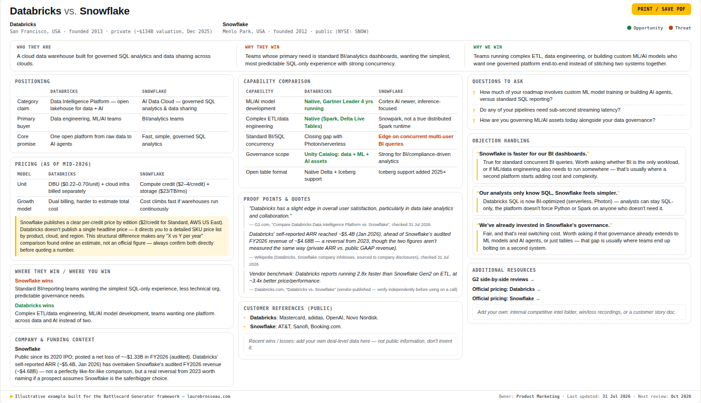

# Battle Card Generator

Knowing who you're up against in a deal is not enough. The rep on the call needs the right content in hand.

Too many deals are lost because a sales rep didn't know how to respond when a competitor's name or argument came up with a prospect.

Battle cards fix that: short, easy-to-use content reps can pull up mid-call. They turn competitive intelligence that's scattered across a PMM's head, a rep's memory, or a Slack thread into something actionable. 

**Leverage this framework and AI prompts to turn raw competitive data into a sales-ready battle card in a few minutes.**

For Product Marketers, Sales, and anyone who owns competitive intelligence and needs a battle card that actually gets used.

 
  
<em>Example of a battle card created with the battle card generator 
</em>

## The problem

Many competitive battle cards are ineffective because:  
- They're built once and never updated, so sales stop using them.
- They're too long, too exhaustive, thus not usable in real-life situations.
- They often tell sales reps *what* the competitor does, but not *what to say* or *how to answer* against specific arguments.

A good battle card is short, straight to the point, and easy to access. It helps the sales rep quickly understand the ins and outs of a specific competitor.  

So here's what you'll find in this repo: a battle card framework, ready-to-use prompts, and battle card real-life examples.  

## What's in this repo

| File | What it's for |
|---|---|
| [`framework.md`](./framework.md) | The battle card structure itself, the 10 sections every battle card should have, and why |
| [`prompts.md`](./prompts.md) | Two ready-to-use prompts for Claude/ChatGPT: 1st one turns raw research (pricing pages, reviews, call notes) into a battle card following my framework, 2nd one formats the battle card into a HTML template. |
| [`battlecard-template.html`](./battlecard-template.html) | A printable one-pager format sales can keep open during a call. It's a plain HTML/CSS file, you can edit it freely: colors, layout, or content, in any text editor, or paste the file into Claude (or another AI assistant) and ask it to make the changes for you  |
| [`battlecard-template.md`](./battlecard-template.md) | A Notion/Google Docs-ready version of the template, plain Markdown you can paste directly into your workspace |
| [`battlecard-shopify-vs-bigcommerce.html`](./examples/battlecard-shopify-vs-bigcommerce.html) | Mid-market example (Shopify vs BigCommerce): download the file and open it with your browser to see the render |
| [`battlecard-databricks-vs-snowflake.html`](./examples/battlecard-databricks-vs-snowflake.html) | Enterprise example (Databricks vs Snowflake): download the file and open it with your browser to see the render |
| [`screenshot-shopify-bigcommerce.png`](./assets/screenshot-shopify-bigcommerce.png) | A screenshot of the battle card Shopify vs BigCommerce to show you the final render |
| [`screenshot-databricks-snowflake.png`](./assets/screenshot-databricks-snowflake.png) | A screenshot of the battle card Databricks vs Snowflake to show you the final render |

## How to use it

1. Gather raw data on your competitor: pricing page, G2/Capterra reviews, recent changelog or launch announcements, call notes where reps mentioned them, LinkedIn posts from their leadership..
2. Paste that raw material into the prompt in [`prompts.md`](./prompts.md), along with your own product's positioning. Use [`battlecard-template.md`](./battlecard-template.md) if you're working in Notion or Docs, or [`battlecard-template.html`](./battlecard-template.html) for the printable one-pager.
4. Review and correct the AI output, never ship a battle card you haven't fact-checked. AI helps accelerate the battle card creation but you should always verify data before sharing it with sales reps.  
5. Once finalized, run it by a sales rep who knows well this specific competitor, they'll help validate the content and tell you if they'd phrase something differently on a call. If so, ask why, and revise your battle card based on their answer.
6. Set a recurring reminder (monthly, or triggered by a competitor product update) to refresh it, an outdated battle card is worse than no battle card.

## Why I built this

I love digging up data on competitors, and turning that into intelligence sales reps can actually use in a deal.

That's exactly what I did at Akeneo: I combined online research with field intel from sales rep interviews and CRM data to build competitor decks, the first battle cards, and competitive landscapes, then ran enablement sessions with GTM teams.

From my experience, I know that sales reps need concrete arguments and not marketing fluff when competition comes up with a prospect. This framework reflects what sales actually need, not what looks good in a slide deck.

## About me

I'm Laure, a Product Marketing and Strategic Projects leader exploring how AI can make Product Marketing Managers work faster while keeping the quality bar high.  
More at [laurebrosseau.com](https://laurebrosseau.com) or [connect on LinkedIn](https://www.linkedin.com/in/laurebrosseau/).
