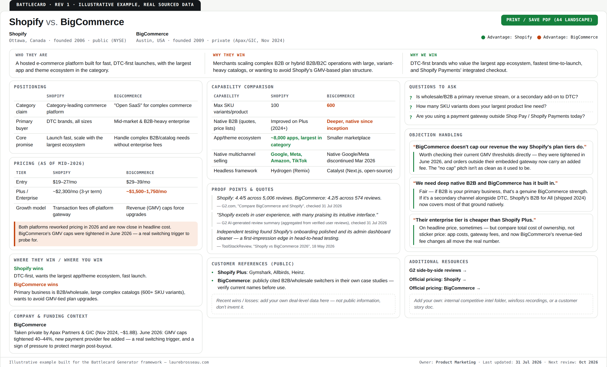

# Battle Card Generator

It's not enough to know who you're up against, the rep on the call needs the right content in hand.  

You do not want Sales to lose deals to competitors because they didn't know how to respond or what to say when the competitor's name or arguments came up in a conversation with a prospect. 

That's exactly what battle cards are for. They turn competitive intelligence that usually exists somewhere, in a Product Marketing Manager's head, in a sales rep's memory of a tough prospect call, in an old Slack thread, but rarely anywhere a sales rep can actually access it live.

**Leverage this framework and AI prompts to turn raw competitive data into a sales-ready battle card in a few minutes.**

 
  
<em>Example of a battle card created with the Battle card Generator 
</em>

## The problem

But many competitive battle cards are ineffective for the same reasons:  
- They're built once and barely updated, so sales stop using them.
- They're too long, too exhaustive, thus not usable in real-life situations.
- They often tell sales reps *what* the competitor does, but not *what to say* or *how to answer* against specific arguments.

A good battle card is short, straight to the point, and accessible. It helps the sales rep quickly understand the ins and outs of a specific competitor.  

So here's what you'll find in this repo: a repeatable structure, ready-to-use prompts, and battle card examples, so anyone in Product Marketing can go from scattered competitor notes to a usable battle card fast, with or without AI.

## What's in this repo

| File | What it's for |
|---|---|
| [`framework.md`](./framework.md) | The battle card structure itself, the 10 sections every battle card should have, and why |
| [`prompts.md`](./prompts.md) | Two ready-to-use prompts for Claude/ChatGPT: 1st one turns raw research (pricing pages, reviews, call notes) into a battle card following my framework, 2nd one formats the battle card into a HTML template. |
| [`battlecard-shopify-vs-bigcommerce.html`](./battlecard-shopify-vs-bigcommerce.html) | Mid-market example (Shopify vs BigCommerce): download the file and open it with your browser to see the render |
| [`battlecard-databricks-vs-snowflake.html`](./battlecard-databricks-vs-snowflake.html) | Enterprise example (Databricks vs Snowflake): download the file and open it with your browser to see the render |
| [`battlecard-template.html`](./battlecard-template.html) | A printable one-pager format sales can keep open during a call. It's a plain HTML/CSS file, you can edit it freely: colors, layout, or content, in any text editor, or paste the file into Claude (or another AI assistant) and ask it to make the changes for you  |

## How to use it

1. Gather raw data on your competitor: pricing page, G2/Capterra reviews, recent changelog or launch announcements, call notes where reps mentioned them, LinkedIn posts from their leadership..
2. Paste that raw material into the prompt in [`prompts.md`](./prompts.md), along with your own product's positioning.
3. Review and correct the AI output, never ship a battle card you haven't fact-checked. AI helps accelerate the battle card creation but you should always verify data before sharing it with sales reps.  
4. Once finalized, run it by a sales rep who knows well this specific competitor, they'll help validate the content and tell you if they'd phrase something differently on a call. If so, ask why, and revise your battle card based on their answer.
5. Set a recurring reminder (monthly, or triggered by a competitor product update) to refresh it, an outdated battle card is worse than no battle card.

## Why this approach

At Akeneo, I owned competitive intelligence for all our offers and segments. I built the 1st battle cards, competitive landscapes and ran enablement sessions with the GTM teams.  
Sales reps need concrete arguments, not marketing fluff, to have conversations with the prospects about the competition. The framework reflects what sales actually need, not what looks good in a slide deck.

## About me

I'm Laure, a Product Marketing and Strategic Projects leader exploring how AI can make Product Marketing Managers work faster while keeping the quality bar high.  
More at [laurebrosseau.com](https://laurebrosseau.com). [Connect on LinkedIn](https://www.linkedin.com/in/laurebrosseau/).
